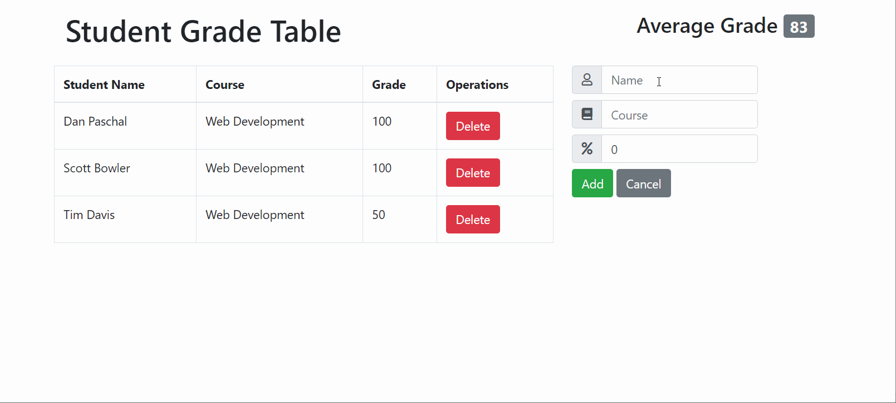

# student-grade-table

A full stack JavaScript CMS for managing student grades and classes

## Technologies Used

- React.js
- Webpack 4
- Bootstrap 4
- HTML5
- CSS3

## Live Demo

Try the application live at <https://studentgrades.samcnagle.com>

## Features

- Users can view a list of all recorded grades.
- Users can view the average of all grades.
- Users can add a student and their grade to the table.
- Users can delete a student and their grade from the table.

## Preview



## Development

#### System Requirements

- NPM 6 or higher
- MySQL 7 or higher

#### Getting Started

1. Clone the repository.

    ```shell
    git clone https://github.com/kittenbites/student-grade-table.git
    cd student-grade-table
    ```

2. Install all dependencies with NPM.

    ```shell
    npm install
    ```


3. Start the project. Once started you can view the application by opening http://localhost:3000 in your browser.

    ```shell
    npm run dev
    ```
